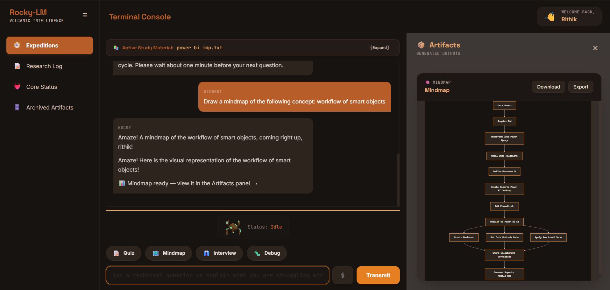
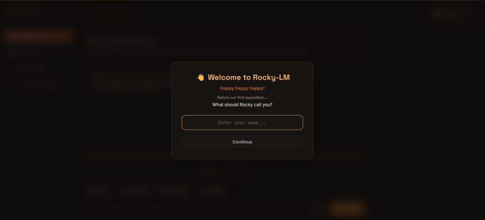
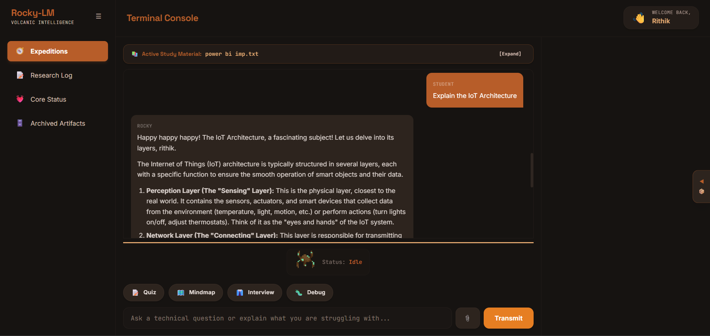
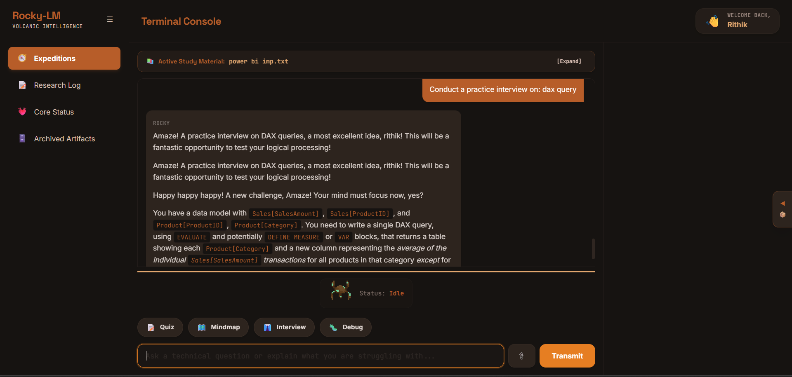
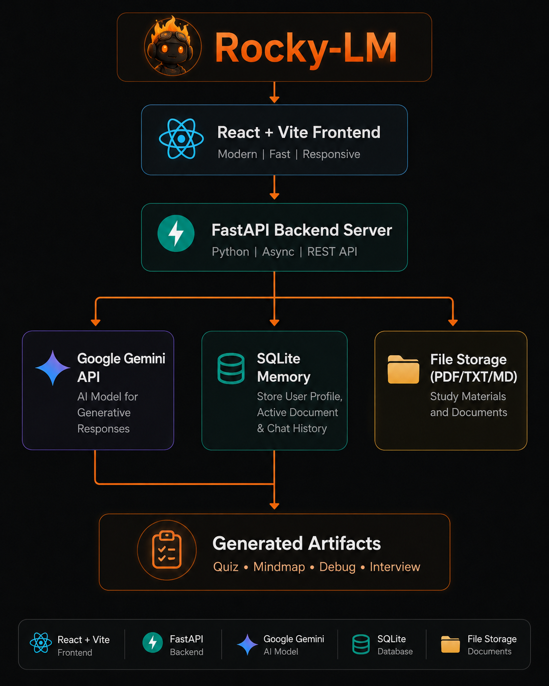
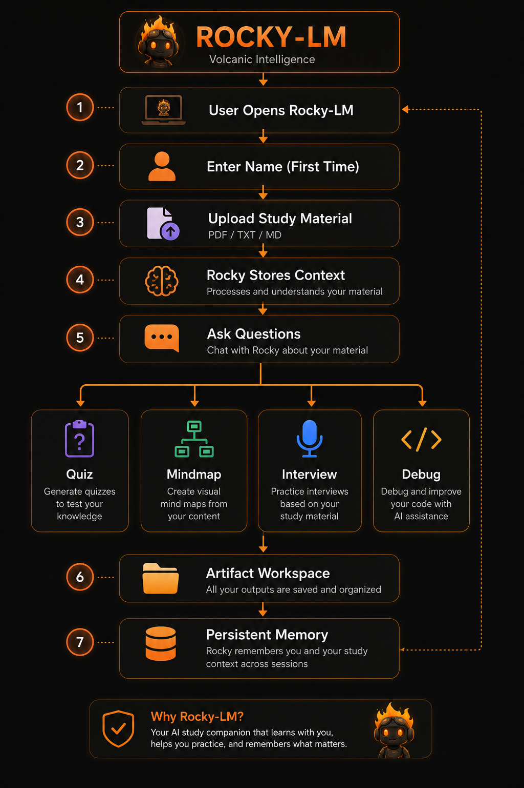

# 🚀 Rocky-LM

### *Volcanic Intelligence*

> **An AI-powered study companion that transforms your notes into an interactive learning workspace.**

Rocky-LM is a full-stack AI learning assistant designed to help students learn more effectively from their own study materials. Instead of acting as a general-purpose chatbot, Rocky focuses on uploaded study notes, allowing users to ask questions, generate quizzes, create visual mind maps, practice interviews, debug code, and retain learning context across sessions.

---

## ✨ Features

### 📄 Study Material Upload
- Upload **PDF**, **TXT**, and **Markdown** files.
- Automatic text extraction and indexing.
- Active study material persists across sessions.

### 🤖 Conversational AI
- Ask questions about uploaded notes.
- Streaming AI responses.
- Markdown and code rendering.

### 🧠 Persistent Memory
- Remembers the active study document.
- Remembers the user's profile.
- Personalized conversations across application restarts.

### 📝 Quiz Generator
Generate quizzes directly from uploaded study material.

### 🗺️ Mind Map Generator
Automatically generate Mermaid-powered visual mind maps.

### 🎤 Interview Practice
Practice technical interviews based on uploaded content.

### 💻 Code Debugger
Analyze, review and improve source code with AI assistance.

### 📦 Artifact Workspace
Generated quizzes, mind maps and code reviews are displayed inside a dedicated artifact workspace.

### ⚡ Modern User Experience
- Responsive React interface
- Personalized onboarding
- Smooth animations
- Interactive workspace
- Persistent study sessions

---

# 🖼️ Screenshots

## Rocky-LM Dashboard

> *Main workspace*



---

## User Onboarding



---

## AI Conversation



---

## Interview Preparation



---

# 🏗️ System Architecture



### High-Level Flow

```text
React Frontend
        │
        ▼
FastAPI Backend
        │
        ▼
 Google Gemini API
        │
        ▼
SQLite Persistent Memory
        │
        ▼
Generated Artifacts
```

---

# 🔄 Application Workflow



```text
User Uploads Notes
        │
        ▼
Rocky Processes Study Material
        │
        ▼
Ask Questions
        │
 ┌──────┼─────────┬──────────┐
 ▼      ▼         ▼          ▼
Quiz  Mindmap  Interview  Code Review
        │
        ▼
Artifact Workspace
```

---

# 🛠️ Tech Stack

## Frontend

- React
- Vite
- Tailwind CSS
- JavaScript

## Backend

- FastAPI
- Python

## AI

- Google Gemini
- MCP (Model Context Protocol)

## Database

- SQLite

## Other Libraries

- Mermaid.js
- Markdown Rendering
- PyPDF2

---

# 📁 Project Structure

```text
Rocky-app
│
├── backend
│   ├── config.py
│   ├── main.py
│   ├── requirements.txt
│   └── .env.example
│
├── frontend
│   ├── src
│   │   ├── components
│   │   ├── hooks
│   │   ├── services
│   │   └── assets
│   └── package.json
│
├── README-assets
│
└── README.md
```

---

# 🚀 Installation

## Clone Repository

```bash
git clone https://github.com/rithikcr-mb/rocky-lm.git
cd Rocky-LM
```

---

## Backend

```bash
cd backend

pip install -r requirements.txt

python main.py
```

---

## Frontend

```bash
cd frontend

npm install

npm run dev
```

---

# 🔑 Environment Variables

Create a `.env` file inside the backend folder.

```env
GEMINI_API_KEY=your_api_key_here
```

You can copy the template provided in:

```text
backend/.env.example
```

---

# 💡 Future Improvements

- Adaptive Study Coach
- Flashcard Generation
- OCR Support
- Voice Conversations
- Multi-document Workspace
- Revision Planner
- Calendar Integration

---

# ⚠️ Disclaimer

Rocky-LM is an educational capstone project developed solely for learning and demonstration purposes.

The "Rocky" character, name, and related references are inspired by existing intellectual property and are used exclusively in a non-commercial educational context. This project is **not affiliated with, endorsed by, or associated with the respective copyright holders**.

If this project is developed beyond educational use, all third-party intellectual property will be replaced with original branding and assets.

---

# 👨‍💻 Author

**Rithik R**

---

# ⭐ Acknowledgements

- Google Gemini
- FastAPI
- React
- Vite
- Tailwind CSS
- Mermaid.js

---

If you found this project interesting, consider giving it a ⭐ on GitHub.